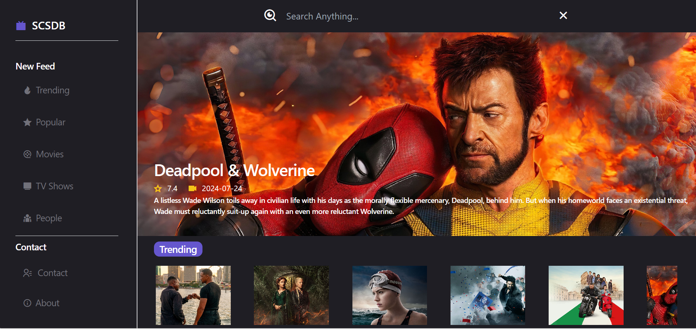
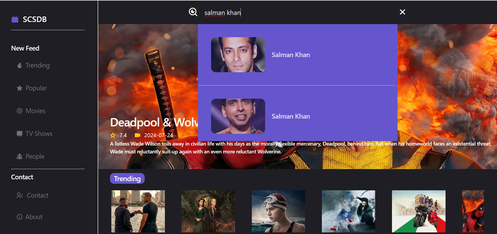
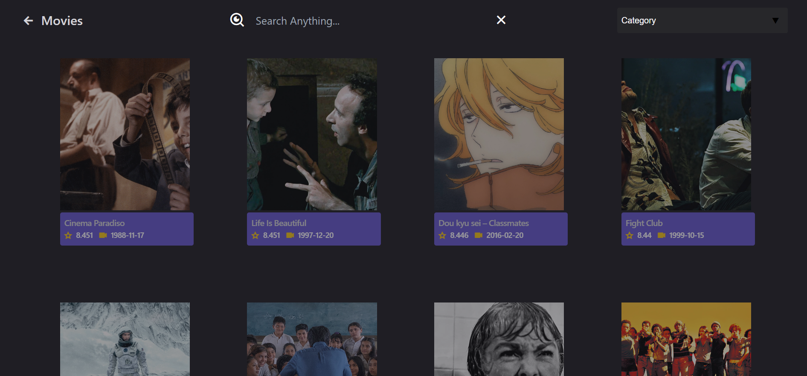
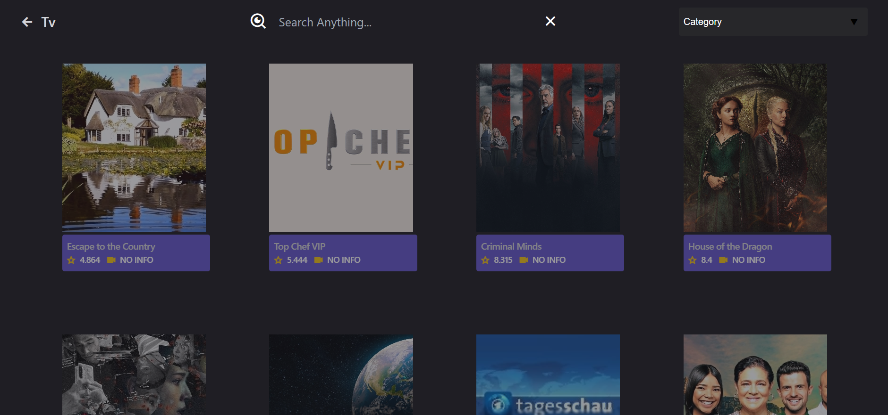
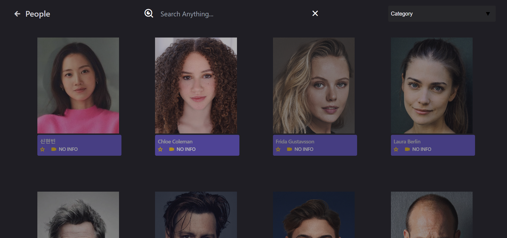
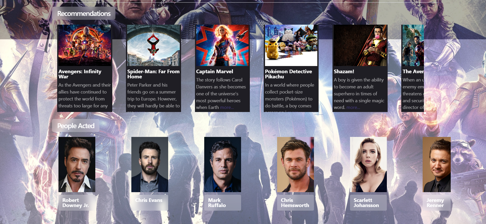

TV App: Your Ultimate Entertainment Guide 📺
https://scsdb.netlify.app/

Here are some Glimpses 📸

Dive ⚓ into the world of movies, TV shows, and your favorite actors with our TV App! Discover trending titles, explore detailed information, and read insightful reviews. Built with ReactJS for efficient UI, Redux Toolkit for state management, Tailwind CSS  for rapid styling, React Router Dom for seamless navigation, and Axios for fetching data from TMDB API. Remix Icons add visual appeal, while Netlify ensures a robust hosting platform.

We welcome your feedback and contributions! Feel free to open issues, pull requests, or connect with us for collaboration.🙌